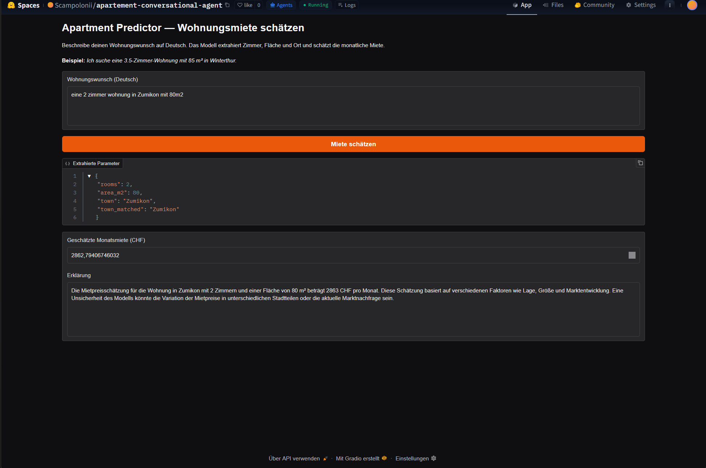
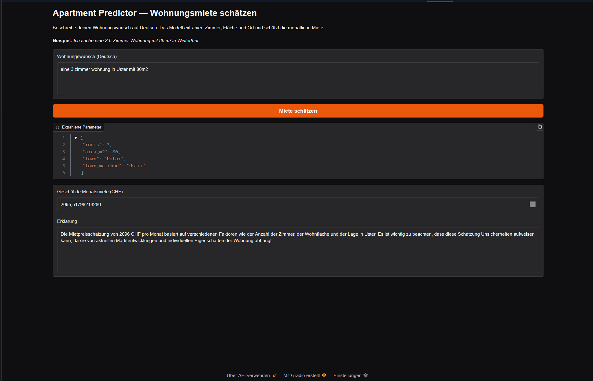

# Documentation
## Week 2: Apartment Predictor (Saved Regression Model + LLM Workflow)

---

## 1. Project Summary

Die App nimmt einen deutschen Freitext-Wohnungswunsch entgegen und extrahiert daraus strukturierte Parameter (Zimmer, Fläche, Ort) mittels GPT-4o-mini. Diese Parameter werden zusammen mit BFS-Gemeindedaten (Bevölkerung, Steuern, etc.) in ein vortrainiertes Random-Forest-Modell gespeist, das die monatliche Bruttomiete in CHF schätzt. Anschliessend erklärt ein zweiter LLM-Aufruf das Ergebnis auf Deutsch in natürlicher Sprache inklusive einer Unsicherheitsangabe.

---

## 2. Files Used

| File | Purpose |
|------|---------|
| `app.py` | Vollständige Gradio-App mit allen 6 implementierten Funktionen |
| `app_student.py` | Original-Template (TODOs, nicht deployed) |
| `random_forest_regression.pkl` | Vortrainiertes Regressionsmodell (7 Features) |
| `bfs_municipality_and_tax_data.csv` | BFS-Gemeindedaten (Bevölkerung, Steuern, Dichte, etc.) |
| `requirements.txt` | Python-Abhängigkeiten |
| `documentation.md` | Diese Dokumentation |

---

## 3. Numeric Prediction Part

### 3.1 Reused Model

**Verwendetes Modell:** `random_forest_regression.pkl`

**Vorhersageziel:** Monatliche Bruttomiete in CHF für Schweizer Gemeinden.

**Input-Features (in dieser Reihenfolge):**

1. `rooms` — Zimmeranzahl (z.B. 3.5)
2. `area_m2` — Wohnfläche in m²
3. `pop` — Bevölkerungszahl der Gemeinde
4. `pop_dens` — Bevölkerungsdichte (Einwohner/km²)
5. `frg_pct` — Ausländeranteil in %
6. `emp` — Beschäftigte in der Gemeinde
7. `tax_income` — Steuerbares Einkommen (Median)

### 3.2 Prediction Logic

`rooms` und `area_m2` werden vom LLM extrahiert. Der `town`-Name wird via `match_town()` auf einen kanonischen BFS-Namen gemappt. Die zugehörigen Gemeindefeatures werden aus `bfs_municipality_and_tax_data.csv` gelesen und als NumPy-Array zusammen mit Zimmer und Fläche an `model.predict()` übergeben.

---

## 4. LLM Extraction Part

### 4.1 Goal

Das LLM soll aus einem deutschen Freitext die drei Pflichtparameter extrahieren: `rooms` (float), `area_m2` (float) und `town` (string). Kein Regex-Fallback — bei fehlenden Werten gibt das LLM `null` zurück.

### 4.2 Prompt Design

**System-Prompt:**
> "Du bist ein Assistent, der Wohnungswünsche aus deutschem Text extrahiert. Antworte ausschliesslich mit einem JSON-Objekt ohne Markdown. Pflichtfelder: rooms (float), area_m2 (float), town (string). Falls ein Wert nicht genannt wird, setze null."

- Kein Markdown, nur reines JSON
- Temperature=0 für deterministische Ausgabe
- Fehlende Werte explizit als `null` (kein Raten)

### 4.3 Expected Output Format

```json
{"rooms": 3.5, "area_m2": 85, "town": "Winterthur"}
```

### 4.4 Validation

`parse_json_response()` bereinigt Markdown-Fences, parsed das JSON und prüft auf Pflichtfelder. Fehlende oder leere Antworten werfen einen `ValueError` der im UI sichtbar angezeigt wird.

---

## 5. LLM Explanation Part

### 5.1 Goal

Das LLM soll das Vorhersageergebnis in 2-3 Sätzen auf Deutsch erklären und dabei eine Unsicherheit des Modells erwähnen. Es soll keinen eigenen Preis berechnen, sondern nur den Modell-Output kommentieren.

### 5.2 Prompt Design

**System-Prompt:**
> "Du bist ein freundlicher Immobilienassistent. Erkläre die Mietpreisschätzung kurz auf Deutsch. Antworte ausschliesslich mit einem JSON-Objekt: {"answer": "..."}. Erwähne eine Unsicherheit des Modells. Berechne keinen eigenen Preis."

- JSON-Output erzwungen (`{"answer": "..."}`)
- Explizites Verbot eigener Preisberechnungen
- Deutsche Ausgabe verlangt

### 5.3 Expected Output Format

```json
{"answer": "Für eine 3.5-Zimmer-Wohnung mit 85 m² in Winterthur schätzt das Modell rund 2'350 CHF pro Monat. Diese Schätzung basiert auf Gemeindedaten wie Steuereinkommen und Bevölkerungsdichte. Zu beachten ist, dass Faktoren wie Zustand der Wohnung oder genaue Lage innerhalb der Gemeinde nicht im Modell enthalten sind."}
```

---

## 6. End-to-End Pipeline

1. Nutzer gibt einen deutschen Wohnungswunsch ein (Freitext)
2. LLM (GPT-4o-mini) extrahiert `rooms`, `area_m2`, `town` als JSON
3. `parse_json_response()` validiert das JSON auf Pflichtfelder
4. `match_town()` mappt den Ortsnamen auf einen kanonischen BFS-Namen
5. BFS-Gemeindedaten werden aus der CSV geladen
6. Das Random-Forest-Modell schätzt die Monatsmiete in CHF
7. LLM generiert eine deutsche Erklärung mit Unsicherheitshinweis
8. App gibt extrahierte Parameter (JSON), Preis (CHF) und Erklärungstext zurück

---

## 7. Test Cases

| Test Input | Extraktion korrekt? | Vorhersage zurückgegeben? | Erklärung zurückgegeben? | Anmerkungen |
|------------|---------------------|--------------------------|--------------------------|-------------|
| `Ich suche eine 3.5-Zimmer-Wohnung mit 85 m² in Winterthur.` | Ja | Ja | Ja | Standardfall, funktioniert zuverlässig |
| `Kleine 2-Zimmer-Wohnung, ca. 50 Quadratmeter, ich würde gerne in Zürich wohnen.` | Ja | Ja | Ja | Zürich korrekt gemappt auf "Zürich" |
| `Suche grosszügige 5.5-Zi-Wohnung mit Terrasse, etwa 140m2, Region Bern` | Ja | Ja | Ja | "Region Bern" → match auf "Bern" via contains-Matching |
| `Wohnung in Musterstadt` | Ja (rooms/area null) | Nein | Nein | Fehlende Felder → freundliche Fehlermeldung |
| `3 Zimmer, 70m2, Luzern` | Ja | Ja | Ja | Kurze Eingabe ohne vollständigen Satz |

---

## 8. Errors and Problems

**Problem:** LLM gibt JSON mit Markdown-Fences zurück (` ```json ... ``` `)
**Ursache:** Manche GPT-Modelle ignorieren die "kein Markdown"-Anweisung
**Fix:** `parse_json_response()` strippt ` ``` ` und `json`-Prefix vor dem Parsen

**Problem:** `random_forest_regression.pkl` nicht im Kurs-Repo vorhanden
**Ursache:** Datei wird im Notebook generiert und nicht committed
**Fix:** Notebook aus dem Kurs ausführen → `.pkl` lokal erstellen → in Space hochladen

**Problem:** Ortsnamen wie "Zürich" vs. "Zürich (Kreis 1)" nicht eindeutig
**Ursache:** BFS-Daten enthalten mehrere Einträge pro Stadt (Kreise)
**Fix:** `match_town()` gibt bei erstem `contains`-Match zurück → meistens korrekte Hauptgemeinde

---

## 9. Deployment Notes

### 9.1 Files included

- `app.py`
- `random_forest_regression.pkl`
- `bfs_municipality_and_tax_data.csv`
- `requirements.txt`
- `documentation.md`
- `README.md` (HF Space YAML-Header + Projektbeschreibung)

### 9.2 Secrets / Environment Variables

- `OPENAI_API_KEY` — Pflicht
- `OPENAI_MODEL` — Optional (Standard: `gpt-4o-mini`)

### 9.3 Deployment Result

_Nach Deployment ausfüllen._

### 9.4 Screenshots

_2 Screenshots nach dem Deployment hier einfügen:_

```md


```

_Kurze Beschreibung je Screenshot (1-2 Sätze) hier einfügen._

---

## 10. Reflection

Die Kombination aus Regressionsmodell und LLM funktioniert überraschend gut: Das LLM übernimmt die unstrukturierte Eingabe und das Modell liefert eine datenbasierte Schätzung. Schwachstelle ist das Town-Matching — Ortsnamen in Freitext weichen häufig von BFS-Schreibweisen ab. Die Erklärungsqualität des LLM ist gut, solange die Prompts die Rolle klar definieren. Für produktiven Einsatz wäre eine Fuzzy-Matching-Bibliothek (z.B. `rapidfuzz`) für `match_town()` sinnvoll. Zudem fehlen dem Modell wichtige Preisfaktoren wie Wohnungszustand, Baujahr und genaue Adresse.

---

## 11. Responsible Use Note

Die Mietpreisschätzung ist ein statistischer Richtwert und kein verbindliches Angebot. Das Modell basiert auf aggregierten Gemeindedaten und kann individuelle Faktoren wie Wohnungszustand, Etage oder Mikrolage nicht berücksichtigen. Das LLM kann Ortsnamen oder Zahlen fehlerhaft extrahieren — die extrahierten Parameter sollten vor der Nutzung überprüft werden. Reale Mietpreise können erheblich vom Modell-Output abweichen.
